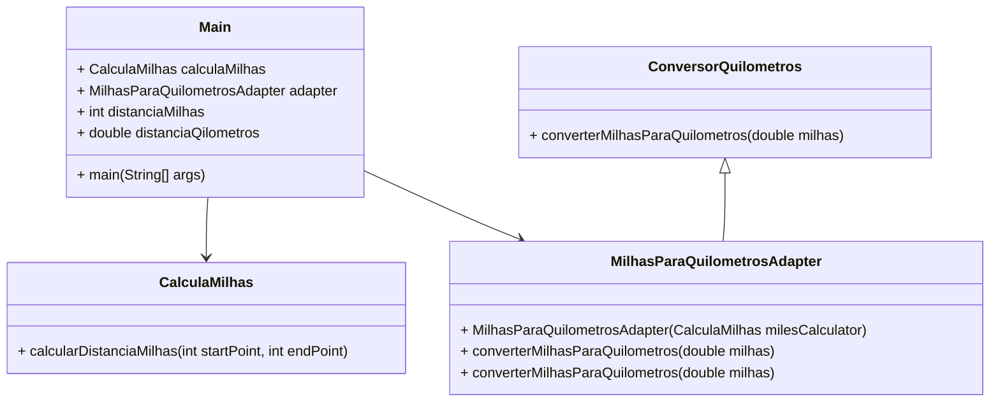

```mermaid
classDiagram
class Main {
    + CalculaMilhas calculaMilhas
    + MilhasParaQuilometrosAdapter adapter
    + int distanciaMilhas
    + double distanciaQilometros
    + main(String[] args)
}

class CalculaMilhas {
    + calcularDistanciaMilhas(int startPoint, int endPoint)
}

class ConversorQuilometros {
    + converterMilhasParaQuilometros(double milhas)
}

class MilhasParaQuilometrosAdapter{
    + MilhasParaQuilometrosAdapter(CalculaMilhas milesCalculator)
    + converterMilhasParaQuilometros(double milhas)
    + converterMilhasParaQuilometros(double milhas)
}

ConversorQuilometros <|-- MilhasParaQuilometrosAdapter 

Main --> CalculaMilhas
Main --> MilhasParaQuilometrosAdapter

```
