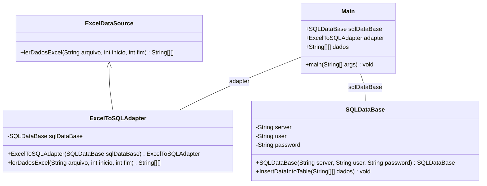

```mermaid
classDiagram
    class ExcelDataSource {
        +lerDadosExcel(String arquivo, int inicio, int fim) String[][]
    }

    class SQLDataBase {
        -String server
        -String user
        -String password
        +SQLDataBase(String server, String user, String password) SQLDataBase
        +InsertDataIntoTable(String[][] dados) void
    }

    ExcelDataSource <|-- ExcelToSQLAdapter

    class ExcelToSQLAdapter {
        -SQLDataBase sqlDataBase
        +ExcelToSQLAdapter(SQLDataBase sqlDataBase) ExcelToSQLAdapter
        +lerDadosExcel(String arquivo, int inicio, int fim) String[][]
    }

    class Main {
        +SQLDataBase sqlDataBase
        +ExcelToSQLAdapter adapter
        +String[][] dados
        +main(String[] args) void
    }

    Main -- ExcelToSQLAdapter: adapter
    Main -- SQLDataBase: sqlDataBase
```
